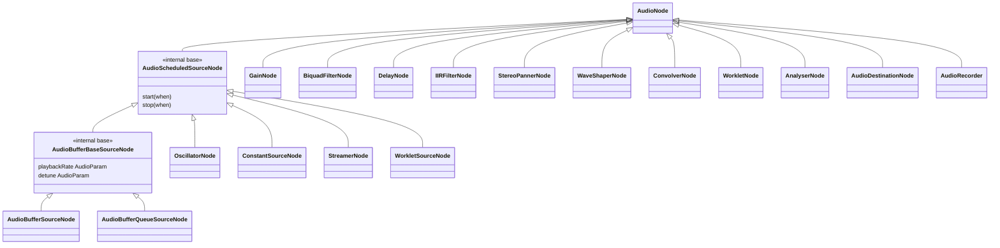

# Skill: AudioNodes

Golden references: `GainNode.h/.cpp` (effect node), `OscillatorNode.h/.cpp` (scheduled source). Mirror their structure for any new node. See [gainnode-example.md](gainnode-example.md) for an annotated header + .cpp.

**If spec defaults or parameter ranges are unclear → fetch https://webaudio.github.io/web-audio-api/ before writing any constructor code.**

---

## Directory Structure

```
common/cpp/audioapi/core/
├── AudioNode.h / .cpp               # Base class for all nodes
├── AudioParam.h / .cpp              # Automatable parameter
├── BaseAudioContext.h / .cpp        # Engine + node factory
├── AudioContext.h / .cpp            # Real-time context
├── OfflineAudioContext.h / .cpp     # Offline rendering context
├── sources/
│   ├── AudioScheduledSourceNode.h   # Base for start/stop sources (INTERNAL)
│   ├── AudioBufferBaseSourceNode.h  # Base for buffer playback (INTERNAL)
│   ├── OscillatorNode.h / .cpp
│   ├── AudioBufferSourceNode.h / .cpp
│   ├── AudioBufferQueueSourceNode.h / .cpp
│   ├── ConstantSourceNode.h / .cpp
│   ├── StreamerNode.h / .cpp        # FFmpeg-based (conditional)
│   ├── WorkletSourceNode.h / .cpp
│   └── RecorderAdapterNode.h / .cpp
├── effects/
│   ├── GainNode.h / .cpp
│   ├── BiquadFilterNode.h / .cpp
│   ├── DelayNode.h / .cpp
│   ├── IIRFilterNode.h / .cpp
│   ├── StereoPannerNode.h / .cpp
│   ├── WaveShaperNode.h / .cpp
│   ├── ConvolverNode.h / .cpp
│   ├── WorkletNode.h / .cpp
│   └── PeriodicWave.h / .cpp        # Wave table (not a node)
├── analysis/
│   └── AnalyserNode.h / .cpp
├── destinations/
│   └── AudioDestinationNode.h / .cpp
├── inputs/
│   └── AudioRecorder.h / .cpp
└── utils/
    └── AudioGraphManager.h / .cpp
```

---

## The Audio Thread Contract

`processNode()` runs on the **audio thread** — the real-time rendering thread driven by the native audio driver (Oboe on Android, CoreAudio on iOS). This thread has strict requirements:

**MUST NOT in `processNode()`:**
- Allocate or free memory (`new`, `delete`, `malloc`, `free`, `std::vector::push_back` that grows, etc.)
- Acquire any mutex or lock (`std::mutex`, `std::lock_guard`, etc.)
- Make any blocking syscall (file I/O, socket, `sleep`, `wait`)
- Call into JavaScript — no JSI calls, no `callInvoker_->invokeSync()`
- Throw exceptions (or rely on exception unwinding paths that allocate)

**Preallocate everything in the constructor:**
```cpp
// Constructor — JS thread, allocations OK
GainNode::GainNode(const std::shared_ptr<BaseAudioContext> &context, const GainOptions &options)
    : AudioNode(context, options) {
  // Preallocate the AudioBuffer used during processing
  audioBuffer_ = std::make_shared<AudioBuffer>(channelCount_, context->getBufferSize());

  // Preallocate params — they own their internal AudioBuffer too
  gainParam_ = std::make_shared<AudioParam>(
      options.gain, -3.4028234663852886e+38f, 3.4028234663852886e+38f, context);
}

// processNode — audio thread, NO allocations
std::shared_ptr<AudioBuffer> GainNode::processNode(
    const std::shared_ptr<AudioBuffer> &processingBuffer,
    int framesToProcess) {
  // Already-allocated buffer reused each render quantum
  auto gainValues = gainParam_->processARateParam(framesToProcess, time);
  for (size_t i = 0; i < processingBuffer->getNumberOfChannels(); i++) {
    processingBuffer->getChannel(i)->multiply(*gainValues->getChannel(0), framesToProcess);
  }
  return processingBuffer;
}
```

---

## Class Hierarchy



### AudioScheduledSourceNode (internal only — not exposed to JS directly)

Base class for source nodes that have a scheduled start and stop time. **Not instantiated directly.**

```cpp
// Playback state machine
enum class PlaybackState {
  UNSCHEDULED,      // before start() called
  SCHEDULED,        // start() called, waiting for startTime_
  PLAYING,          // actively producing audio
  STOP_SCHEDULED,   // stop() called, waiting for stopTime_
  FINISHED          // done, node will be disabled
};
```

Subclasses call `updatePlaybackInfo(currentTime, framesToProcess)` at the top of `processNode()` to transition the state machine and handle sample-accurate start/stop.

When the node finishes, fire the `ENDED` event to JS via `audioEventHandlerRegistry_->invokeHandlerWithEventBody(AudioEvent::ENDED, {})`.

---

## processNode() Signature

```cpp
protected:
  // Audio-thread only
  virtual std::shared_ptr<AudioBuffer> processNode(
      const std::shared_ptr<AudioBuffer> &processingBuffer,
      int framesToProcess) = 0;
```

- `processingBuffer` — already contains the mixed input from all connected input nodes. Modify in-place and return it.
- `framesToProcess` — number of samples per channel to process, typically 128 (RENDER_QUANTUM_SIZE).
- Called by `AudioNode::processAudio()` which handles input mixing, channel count modes, and deduplication (via `lastRenderedFrame_`).

---

## Thread Annotations in Header Files

**Annotate every method with the thread it is safe to call from.** Use comments in the header:

```cpp
class MyNode : public AudioNode {
 public:
  // JS-thread only
  void setSomething(float value);
  float getSomething() const;

 protected:
  // Audio-thread only
  std::shared_ptr<AudioBuffer> processNode(
      const std::shared_ptr<AudioBuffer> &processingBuffer,
      int framesToProcess) override;
};
```

In `AudioParam.h` the pattern is:
```cpp
/// JS-Thread only methods
[[nodiscard]] inline float getValue() const noexcept { ... }
void setValue(float value);
void setValueAtTime(float value, double startTime);

/// Audio-Thread only methods
std::shared_ptr<AudioBuffer> processARateParam(int framesToProcess, double time);
float processKRateParam(int framesToProcess, double time);
```

---

## AudioParam — Automatable Parameters

Every automatable property (frequency, gain, detune, Q, etc.) is an `AudioParam`.

```cpp
gainParam_ = std::make_shared<AudioParam>(
    defaultValue,
    minValue,
    maxValue,
    context
);
```

### A-rate vs K-rate

- **A-rate (audio-rate)**: one value per sample — use when the parameter can change significantly within a render quantum (e.g. frequency modulation)
  ```cpp
  // Call processARateParam() for per-sample values — returns AudioBuffer, no allocation
  auto gainValues = gainParam_->processARateParam(framesToProcess, time);
  float *values = gainValues->getChannel(0)->getData();
  // values[i] is the gain for frame i
  ```

- **K-rate (control-rate)**: one value per render quantum — use when the parameter changes slowly
  ```cpp
  // Call processKRateParam() for a single block-wide value
  float gain = gainParam_->processKRateParam(framesToProcess, time);
  // Single value for the whole block
  ```

### JS → Audio Thread parameter updates

`CrossThreadEventScheduler<T>` is a lock-free SPSC channel. When JS calls `param.setValueAtTime(...)`, it enqueues a lambda on the scheduler. The audio thread drains the queue at the start of each `processARateParam` / `processKRateParam` call.

```cpp
// JS-thread (in AudioParam):
void AudioParam::setValueAtTime(float value, double startTime) {
  eventScheduler_.scheduleEvent([value, startTime](AudioParam &param) {
    param.eventsQueue_.insertEvent(...);
  });
}

// Audio-thread (inside processARateParam):
eventScheduler_.processAllEvents(*this);  // drain all pending events
```

**Important**: HostObject setters forward to the node/param asynchronously through this scheduler. By the time `processNode()` runs, the queued update may or may not have been applied yet, depending on timing. Design accordingly — never assume immediate consistency.

---

## Cross-Thread Communication Patterns

### JS → Audio (parameter/graph updates)
Use `CrossThreadEventScheduler` (lock-free SPSC queue). See `utils/CrossThreadEventScheduler.hpp`.

### Audio → JS (events like `ended`, `loopEnded`, `positionChanged`)
Use `IAudioEventHandlerRegistry::invokeHandlerWithEventBody()` which internally calls `callInvoker_->invokeAsync()` — this safely schedules the JS callback on the JS thread from the audio thread.

```cpp
// Audio-thread: fire 'ended' event
audioEventHandlerRegistry_->invokeHandlerWithEventBody(
    AudioEvent::ENDED, {});
```

Callback IDs are stored as `std::atomic<uint64_t>` on the node. `0` means no listener registered.

### JS → Audio (graph mutations: connect/disconnect)
All graph mutations are queued via `AudioGraphManager` using its own SPSC channel (`addPendingNodeConnection`, `addPendingParamConnection`). The audio thread calls `graphManager_->preProcessGraph()` before each render pass to apply pending changes.

---

## Implementing a New Node — Checklist

1. **Subclass the right base**
   - `AudioNode` — standard effect or analysis node
   - `AudioScheduledSourceNode` — source with start/stop scheduling
   - `AudioBufferBaseSourceNode` — source that plays back an AudioBuffer with pitch control

2. **Header file** (`core/<category>/MyNode.h`)
   - Annotate every method with `// JS-thread only` or `// Audio-thread only`
   - Declare `processNode()` in `protected:`
   - Declare `AudioParam` members for automatable properties
   - Preallocate all buffers you'll need in `private:` state

3. **Constructor** (runs on JS thread)
   - Call `AudioNode(context, options)` base constructor with correct `numberOfInputs`, `numberOfOutputs`
   - Create all `AudioParam` instances with correct default/min/max values from the Web Audio spec
   - Preallocate any DSP state buffers (IIR delay lines, ring buffers, etc.)
   - Do NOT call `context_->...` in `processNode()` for anything that could block

4. **processNode()** (runs on audio thread)
   - Call `context_.lock()` to get a `shared_ptr<BaseAudioContext>` — return early if null
   - Call `context->getCurrentTime()` for automation timing
   - Use `processARateParam()` or `processKRateParam()` to read param values
   - Process samples in-place on `processingBuffer`
   - No allocations, no locks, no blocking I/O

5. **HostObject** (see the `host-objects` skill)
   - Create `MyNodeHostObject` extending `AudioNodeHostObject`
   - Add factory method to `BaseAudioContextHostObject` (`createMyNode`)
   - Add factory method to `BaseAudioContext` C++ class

6. **TypeScript API** (see the `turbo-modules` skill)
   - Add TS class in `src/core/`
   - Export from package index

7. **Spec compliance**
   - Check the Web Audio API spec for default values, parameter ranges, and behavior
   - See `web-audio-api.md` skill

8. **Tests and docs** — see the `flow` skill

See [full GainNode example](gainnode-example.md) for a complete header + .cpp reference implementation.

---

## Web Audio API Spec Reference

All node behavior (parameter names, default values, valid ranges, processing semantics) must match the spec:
- https://webaudio.github.io/web-audio-api/

Key spec-defined constraints already encoded in the codebase:
- `AudioParam` min/max values come from spec tables
- `GainNode.gain` default = 1.0, no clamping
- `BiquadFilterNode.frequency` default = 350 Hz, range [Nyquist - epsilon, Nyquist]
- `OscillatorNode.frequency` default = 440 Hz
- Render quantum = 128 frames

---

*Maintenance: see [maintenance.md](maintenance.md).*
